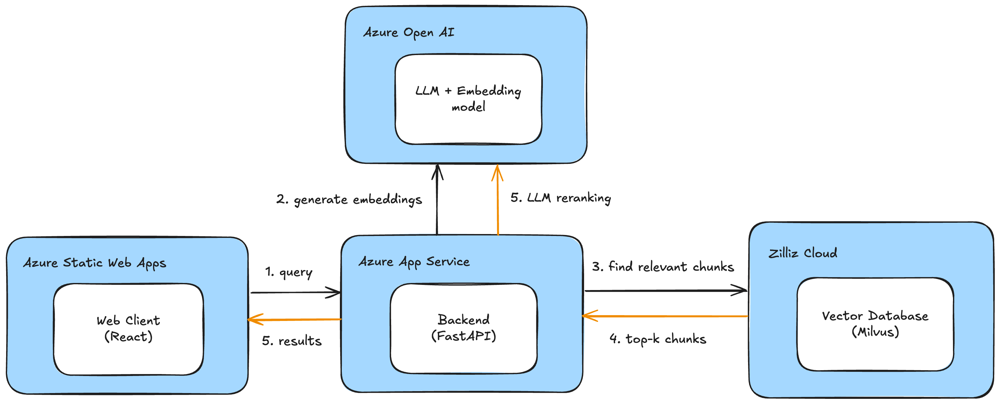

# Code Compass

**Code Compass** is an AI-powered web app for searching and exploring codebases using natural language queries. Instead of relying on traditional keyword search, users can ask questions or describe what they are looking for.

---

## Features

- 🔎 **Semantic code search** using natural language
- 🧠 **Advanced embeddings:** code snippets + LLM-generated summary for deeper understanding
- ⚡ **Hybrid search:** combines vector similarity with keyword-based search for high accuracy
- 🏆 **Reranking:** relevant results are prioritized using LLM-powered reranker
- 🖥️ Simple web UI (React + Vite)
- 🚀 Supports multiple languages

---

## Architecture

- **Frontend:** React + Vite, hosted on Azure Static Web App  
- **Backend:** Python, FastAPI, llama-index, hosted on Azure App Service  
- **Vector Database:** Milvus (Zilliz Cloud)  
- **LLM Provider:** Azure OpenAI (for embedding & reranking)

